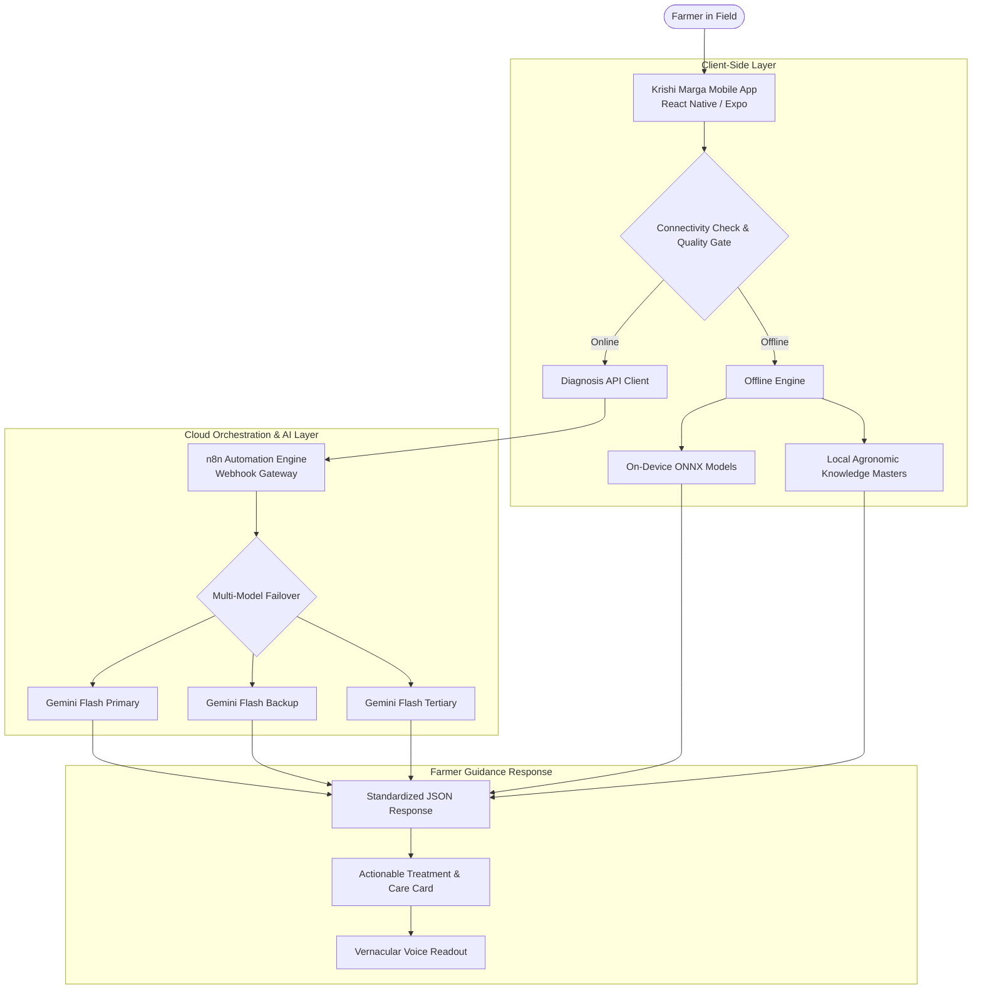

# Krishi Marga

**Krishi Marga** (ಕೃಷಿ ಮಾರ್ಗ / உழவர் வழி / కృషి మార్గం) is an AI-powered agricultural assistance platform engineered to deliver rapid, field-tested crop disease diagnosis, pesticide information scanning, offline agronomic guidance, and regional-language advisory to Indian farmers.

---

## Overview

Krishi Marga bridges the critical gap between laboratory-grade agricultural science and daily on-field decision-making. By combining multimodal cloud vision AI, on-device offline edge intelligence, and curated regional agronomic repositories, the platform assists farmers in identifying crop anomalies, understanding chemical and organic treatments, accessing local Raitha Samparka Kendras (RSK) and Krishi Vigyan Kendras (KVK), and making timely crop-protection decisions.

---

## Problem

Smallholder and regional farmers frequently face severe yield loss due to delayed or inaccurate diagnosis of foliar diseases, pest infestations, and micro-nutrient deficiencies. Field extension officers and agricultural scientists cannot physically visit every smallholding during sudden outbreaks. Furthermore, rural internet connectivity is often intermittent, and complex chemical labels on pesticides are challenging to interpret correctly in regional dialects.

---

## Solution

Krishi Marga provides a comprehensive, farmer-first mobile application featuring:
- **Intelligent Visual Diagnosis**: Multimodal cloud analysis with multi-model failover for comprehensive disease evaluation.
- **Pesticide Label Scanner**: Optical parsing and breakdown of active ingredients, target pests, dosage, and safety guidelines.
- **Offline Reliability**: On-device edge inference and an embedded agronomic database for uninterrupted operation in connectivity-constrained zones.
- **Native Vernacular Support**: Complete UI, diagnosis outputs, and voice playback in 6 major Indian languages.
- **Institutional Connectivity**: Instant access to verified Karnataka RSK and South Indian agricultural doctor networks.

---

## Key Features

- **AI Crop Disease Diagnosis**: Upload or capture single or multi-angle foliar images (up to 10 photos) for automated symptom detection, severity assessment, and remedial guidance.
- **Pesticide Scanner**: Analyzes chemical labels to clarify active ingredients, CIBRC-approved target pests, approved dilution ratios, and safety wait-periods.
- **Dual Online / Offline Architecture**: Routes diagnosis requests dynamically—leveraging high-parameter cloud models when online, and switching seamlessly to local inference and embedded agronomic masters when offline.
- **Curated 76-Crop Agricultural Knowledge**: Built-in comprehensive symptom, pest, and nutrient matrices for South Indian cereals, pulses, oilseeds, commercial crops, vegetables, fruits, spices, and plantation crops.
- **Regional Language Support**: Fully localized in English, Kannada (ಕನ್ನಡ), Tamil (தமிழ்), Telugu (తెలుగు), Malayalam (മലയാളം), and Hindi (हिन्दी).
- **Voice Readout**: Audio synthesis for diagnostic summaries and treatment steps to assist neo-literate farmers.
- **RSK & Agricultural Specialist Directory**: Direct geo-referenced directory of Raitha Samparka Kendras, KVK extension scientists, and university crop doctors.

---

## System Architecture



---

## Disease Diagnosis Workflow

```
[Leaf Image Capture (1-10 Images)]
               │
               ▼
[Client-Side Quality & Dimension Validation]
               │
               ▼
[Connectivity Check] ───(Offline)──► [Edge ONNX Inference / Agronomic Lookup]
               │                                      │
           (Online)                                   │
               ▼                                      ▼
[Cloud n8n Webhook Gateway]               [Structured Severity & Remedial Data]
               │                                      │
               ▼                                      │
[Multi-Model AI Diagnosis]                            │
               │                                      │
               ▼                                      │
[Confidence & Safety Validation]                      │
               │                                      │
               └──────────────────┬───────────────────┘
                                  ▼
                     [Actionable Treatment Card]
                     (Chemical, Bio & Cultural Controls)
                                  │
                                  ▼
                     [Vernacular Audio Playback]
```

---

## Pesticide Scanner Workflow

```
[Pesticide Bottle / Label Photo]
               │
               ▼
[Pre-scan Validation & Optimization]
               │
               ▼
[n8n Vision Pipeline (/webhook/scan-pesticide)]
               │
               ▼
[Optical Extraction & Chemical Validation]
  • Active Ingredient & Concentration
  • CIBRC Recommended Target Pests
  • Approved Dilution & Application Dosage
  • Safety Precautions & Waiting Period
               │
               ▼
[Farmer-Friendly Safety Card with Vernacular Guidance]
```

---

## Offline Capability

Krishi Marga is engineered for rural resilience:
1. **Validated ONNX Edge Inference**: Currently includes verified production-ready ONNX models (such as the MobileNetV3 Pumpkin foliar pathology model, ~5.8 MB) running locally on-device via ONNX Runtime with sub-10ms CPU latency.
2. **Embedded Agronomic Knowledge Base**: When working completely offline with crops whose dedicated neural weights are not yet cached on-device, the app falls back transparently to curated agronomic masters (`AnalysisSource: 'offline_knowledge'`). This provides farmers with immediate verified symptom profiles, pest guides, and cultural remedies without throwing network connection errors.

*(Note: Additional crop-specific ONNX neural networks are integrated iteratively as validation cycles complete).*

---

## Supported Languages

The application is localized across 6 Indian languages:
- **English** (`en`)
- **Kannada** (`kn` — ಕನ್ನಡ)
- **Tamil** (`ta` — தமிழ்)
- **Telugu** (`te` — తెలుగు)
- **Malayalam** (`ml` — മലയാളം)
- **Hindi** (`hi` — हिन्दी)

All localization dictionaries reside under `src/locales/`.

---

## Technology Stack

| Domain | Technology / Library | Role |
| :--- | :--- | :--- |
| **Mobile Frontend** | React Native, Expo SDK 57, TypeScript | Cross-platform farmer mobile client |
| **UI & Navigation** | React Navigation (Native Stack & Bottom Tabs) | Fluid, intuitive navigation layout |
| **Edge AI Runtime** | ONNX Runtime (`opset 14/18`), MobileNetV3 | Lightweight on-device offline inference |
| **Cloud Orchestration** | n8n Workflow Engine | Webhook processing, image validation & AI routing |
| **Cloud AI Vision** | Google Gemini API (Flash models via n8n failover) | Multimodal visual pathology diagnosis & OCR |
| **Local Storage** | AsyncStorage, SQLite | Local case history & offline crop masters |
| **Community Alerts** | Supabase PostgreSQL (SQL migrations) | Regional pest outbreak registry & geospatial alerts |
| **Audio Services** | Expo Speech / Native TTS | Vernacular voice guidance for diagnosed remedies |
| **Download Landing** | HTML5, CSS3, Vanilla JS, Vercel | Standalone APK distribution web portal |

---

## Project Structure

```
krishi-marga/
├── .env.example                      # Safe environment configuration template
├── .gitignore                         # Strict exclusion of secrets, datasets & caches
├── DATASETS.md                        # Upstream Kaggle dataset references and provenance
├── README.md                          # Repository documentation
├── app.json                           # Expo project configuration manifest
├── babel.config.js                    # Babel compiler configuration
├── package.json                       # Project dependencies and run scripts
├── tsconfig.json                      # TypeScript configuration
├── agricultural_knowledge/            # Curated South Indian agricultural data masters
│   ├── CROP_DISEASE_MASTER.csv
│   ├── CROP_PEST_MASTER.csv
│   ├── PESTICIDE_MASTER.csv
│   ├── FERTILIZER_KNOWLEDGE_MASTER.csv
│   └── SOUTH_INDIA_CROP_DOCTOR_DIRECTORY.csv
├── assets/                            # Branding, crop artwork, and app assets
│   ├── crops/                         # 76 high-resolution crop illustrations
│   ├── logo/                          # Krishi Marga brand identity assets
│   └── models/                        # Preprocessing configs and model classes
├── krishi-marga-download/             # Standalone web landing page for APK distribution
│   ├── index.html
│   ├── script.js
│   ├── style.css
│   └── vercel.json
├── models/                            # Verified production ONNX model artifacts
│   └── onnx/                          # Local on-device inference models
├── n8n/                               # Cloud automation workflow exports
│   ├── README_N8N.md                  # Workflow import and credential setup instructions
│   ├── krishi_marga_workflow.json     # Production dual-endpoint workflow
│   └── ipdm_layer_workflow_extension.json
├── src/                               # Application source code
│   ├── components/                    # Reusable UI components
│   ├── config/                        # Crop definitions (76 crops) & environment config
│   ├── ipdm/                          # Integrated Pest & Disease Management module
│   ├── locales/                       # Multi-language translation dictionaries
│   ├── offline/                       # On-device ONNX engine & preprocessing routines
│   ├── screens/                       # User-facing application screens
│   ├── services/                      # API clients, auth, voice, and database services
│   ├── storage/                       # Local case persistence logic
│   └── theme/                         # Design system tokens and styling
├── supabase/                          # Database migrations for community pest alerts
│   └── migrations/
└── training/                          # Model training pipelines & ONNX export tools
    ├── README.md                      # ML pipeline documentation
    ├── requirements.txt               # PyTorch and training dependencies
    ├── config/                        # Training configurations
    ├── dataset/                       # Dataset guidelines (raw data git-ignored)
    └── scripts/                       # Training, evaluation, and ONNX export scripts
```

---

## Installation & Local Development

### 1. Prerequisites
- **Node.js**: v18.0 or higher
- **npm** or **yarn**
- **Expo Go App** (on Android physical device) or Android Emulator
- **Git**

### 2. Setup Steps

1. **Clone the repository**:
   ```bash
   git clone https://github.com/your-username/krishi-marga.git
   cd krishi-marga
   ```

2. **Install dependencies**:
   ```bash
   npm install
   ```

3. **Configure Environment**:
   ```bash
   cp .env.example .env
   ```
   Configure your secure backend endpoint in `.env`:
   ```env
   EXPO_PUBLIC_BACKEND_URL=https://your-backend-domain.example.com
   ```

4. **Verify TypeScript Compilation**:
   ```bash
   npx tsc --noEmit
   ```

5. **Start the Development Server**:
   ```bash
   npx expo start
   ```
   - Press `a` to open in Android Emulator.
   - Scan the terminal QR code using **Expo Go** on your physical Android smartphone.

---

## Backend Configuration

The mobile application communicates with the backend via a single secure base URL (`EXPO_PUBLIC_BACKEND_URL`). The application automatically routes requests to standard sub-paths:
- `/webhook/detect-disease` (Foliar crop disease diagnosis)
- `/webhook/scan-pesticide` (Pesticide label recognition)

> **Security Note**:
> All sensitive cloud credentials (such as Google Gemini API keys) are managed strictly inside the server-side n8n credential vault. No secret keys or authentication tokens are ever embedded in client source code or compiled into mobile APK binaries.

---

## Offline Model Development & Datasets

To retrain or export ONNX models locally:
1. Review the training instructions in `training/README.md`.
2. Install Python requirements:
   ```bash
   pip install -r training/requirements.txt
   ```
3. In accordance with open-source hygiene, large image datasets are **not stored** in this repository. Datasets can be acquired from verified academic and public repositories:
   - **Dataset 1**: [Plant Disease Classification Merged Dataset (Kaggle)](https://www.kaggle.com/datasets/alinedobrovsky/plant-disease-classification-merged-dataset)
   - **Dataset 2**: [Master Plant Disease Processed Dataset (Kaggle)](https://www.kaggle.com/datasets/harisri2005/plant-disease-processed)
4. For setup details, see [DATASETS.md](file:///DATASETS.md).

---

## Application Release Status

- **Source Code**: Fully audited and verified (0 TypeScript errors).
- **Android APK**: The production Android APK release will be attached following the final EAS cloud build.
- **Web Distribution**: A standalone APK download website is maintained under `krishi-marga-download/` with an independent static deploy structure.

---

## Planned / Future Work

The following modules are planned or under active iterative development:
- **IPDM Community Mesh Synchronization**: Real-time peer-to-peer and cloud-synced regional pest outbreak heatmaps.
- **Full 76-Crop On-Device ONNX Coverage**: Expanding on-device neural model weights across all remaining regional South Indian crops.
- **IoT Microclimate Integration**: Connecting localized soil moisture and ambient humidity sensors for micro-climate disease predisposition forecasting.

---

## Security

- Sensitive credentials, API keys, tokens, and keystores are **not stored** in this repository.
- Environment variables are managed via `.env.example` templates.
- Production webhooks and AI credentials remain strictly confidential on secure backend infrastructure.

---

## Team

- **Team Name**: `[TEAM NAME EXACTLY AS IN AUTHORIZATION LETTER]`
- **Team ID**: `[TEAM ID]`
- **Team Members**: `[ADD ACTUAL TEAM MEMBERS]`

---

## License

License information will be added by the team.
