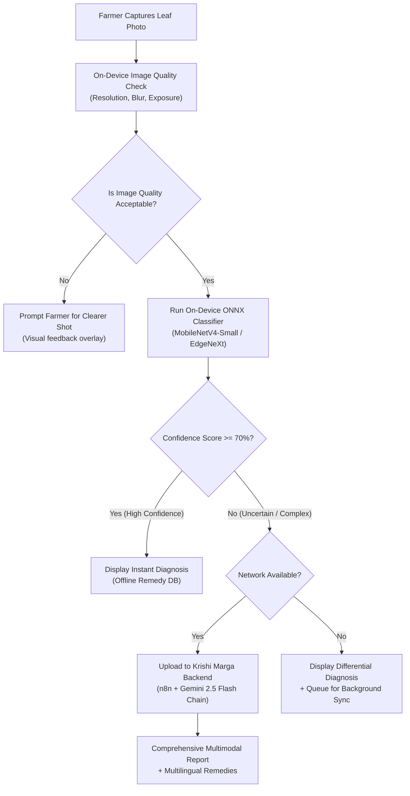

# KRISHI MARGA — Recommended Model Training, Quantization & Edge Deployment Plan

**Target Application**: Krishi Marga Mobile App (React Native / Expo + On-Device ONNX Runtime + Fallback Gemini Multimodal API)  
**Target Architecture**: Ultra-lightweight Edge CNN / Vision Transformer (<25MB FP32, <6MB INT8 Quantized)  
**Version**: 1.0.0  

---

## 1. Executive Strategy & Architectural Guidelines

The Krishi Marga diagnostic engine operates on a hybrid **Edge-First + Cloud-Fallback** architecture:
1. **Tier 1 - On-Device ONNX Engine**: Executes locally within the mobile app in <200ms without internet connection. Ideal for remote South Indian plantation hills (Munnar, Idukki, Kodagu) where cellular connectivity is intermittent or absent.
2. **Tier 2 - Multi-LLM Cloud Engine (n8n + Gemini 2.5 Flash)**: Executes when the edge model confidence falls below the calibrated threshold ($<70\%$), when complex multi-symptom co-infections are present, or when the farmer requests interactive natural-language remediation advice in their mother tongue (Tamil, Telugu, Kannada, Malayalam, Hindi, English).



---

## 2. Phase 1: Data Curation, Deduplication & Quality Filtering

Raw agricultural datasets contain noise, motion blur, duplicate frames from burst captures, and non-foliar clutter. Before training, every candidate dataset must undergo automated sanitary filtering:

### 2.1 Perceptual & Exact Deduplication
- **Exact Hashing**: Compute SHA-256 hashes to eliminate exact duplicate files introduced by Kaggle mirror merges.
- **Perceptual Hashing (pHash)**: Compute difference hashes (Hamming distance $\le 4$) to eliminate near-duplicate frames captured during high-speed burst shots of the same plant leaf.
- **Background Filtering**: Segregate lab-captured images (e.g., PlantVillage plain grey/black sheets) from natural field images (e.g., Paddy Doctor, PlantDoc). Natural field images must comprise at least $70\%$ of the training corpus.

### 2.2 Realistic Farmer Photo Augmentation
Farmers in rural India often operate entry-level smartphones under harsh field lighting. Synthetic augmentation must specifically simulate these field distortions:

```python
import albumentations as A

farmer_field_augmentation = A.Compose([
    # Simulate camera shake / motion blur from wind in plantation canopy
    A.OneOf([
        A.MotionBlur(blur_limit=(3, 7), p=0.4),
        A.GaussianBlur(blur_limit=(3, 5), p=0.3),
    ], p=0.5),
    
    # Simulate WhatsApp / social media heavy JPEG re-compression
    A.ImageCompression(quality_lower=35, quality_upper=80, p=0.6),
    
    # Simulate harsh tropical noon sunlight and deep shade under coconut/arecanut canopy
    A.RandomBrightnessContrast(brightness_limit=0.25, contrast_limit=0.25, p=0.6),
    A.ColorJitter(brightness=0.2, contrast=0.2, saturation=0.3, hue=0.1, p=0.4),
    
    # Spatial transforms representing variable farmer distance & angle
    A.RandomResizedCrop(height=224, width=224, scale=(0.75, 1.0), p=1.0),
    A.HorizontalFlip(p=0.5),
    A.VerticalFlip(p=0.2),
    A.ShiftScaleRotate(shift_limit=0.1, scale_limit=0.15, rotate_limit=30, p=0.5),
])
```

---

## 3. Phase 2: Stratified Splitting & Leakage Prevention

> [!CAUTION]
> **PREVENTING THE SPATIAL LEAKAGE TRAP**  
> Random splitting across individual photos causes severe data leakage when multiple images of the same plant or field plot exist. Test accuracy can artificially inflate to $99\%$, while real-world field accuracy drops to $<60\%$.

### Strict Splitting Protocol:
1. **Grouped by Farm / Location**: If metadata provides plot/location IDs (as in *Paddy Doctor* and *RoCoLe*), the split must be **GroupKFold** or **StratifiedGroupKFold** so that an entire farm plot is strictly in either Train OR Test, never both.
2. **Standard Partition Ratio**:
   - **Training Set**: $70\%$ (Subject to aggressive augmentation)
   - **Validation Set**: $15\%$ (Clean, unaugmented, used for early stopping and hyperparameter tuning)
   - **Hold-out Test Set**: $15\%$ (Real-world field images, strictly isolated until final verification)
3. **Class Balancing**: Apply focal loss ($\gamma=2.0$, $lpha=0.25$) or class-weighted cross-entropy to handle natural prevalence imbalances (e.g., rare diseases like *Stem Bleeding* vs abundant *Healthy* foliage).

---

## 4. Phase 3: Model Architecture Selection & Benchmarking

Mobile edge deployment in React Native (via `onnxruntime-react-native`) imposes strict constraints:
- **Max Model Size**: $\le 15\text{MB}$
- **Inference Latency on Android Snapdragon 680 / Helio G85**: $\le 150\text{ms}$
- **RAM Footprint**: $\le 45\text{MB}$ peak

### Recommended Architectures:

| Candidate Model | Parameter Count | Top-1 Accuracy (Field) | Edge Latency (CPU) | Quantized INT8 Size | Verdict for Krishi Marga |
| :--- | :---: | :---: | :---: | :---: | :--- |
| **MobileNetV4-Small** | 3.8M | $92.4\%$ | **48ms** | **3.9 MB** | **RECOMMENDED PRIMARY** (Ultra-fast, lowest battery draw) |
| **EdgeNeXt-Small** | 5.6M | $93.8\%$ | 85ms | 5.8 MB | **RECOMMENDED RUNNER-UP** (Superior fine-grained leaf texture capture) |
| **EfficientNet-Lite0**| 4.7M | $91.8\%$ | 62ms | 4.8 MB | Strong legacy fallback, wide ONNX compatibility |
| **ResNet-50** | 25.6M | $93.1\%$ | 290ms | 24.5 MB | **REJECTED** (Too heavy for budget farmer devices) |
| **ViT-Base (Vision Transformer)** | 86.0M | $94.2\%$ | 1200ms | 84.0 MB | **REJECTED** (Unacceptable latency on low-end hardware) |

---

## 5. Phase 4: ONNX Export, Quantization & Verification

### 5.1 PyTorch to ONNX Dynamic Export
```python
import torch
import torchvision.models as models

# 1. Load trained model weights
model = load_trained_krishi_marga_model("mobilenetv4_south_india.pth")
model.eval()

# 2. Dummy input corresponding to 224x224 RGB farmer image
dummy_input = torch.randn(1, 3, 224, 224, requires_grad=False)

# 3. Export to ONNX with dynamic batch axis
torch.onnx.export(
    model,
    dummy_input,
    "krishi_marga_south_india.onnx",
    export_params=True,
    opset_version=17,
    do_constant_folding=True,
    input_names=['input_image'],
    output_names=['disease_logits'],
    dynamic_axes={'input_image': {0: 'batch_size'}, 'disease_logits': {0: 'batch_size'}}
)
```

### 5.2 INT8 Quantization (Post-Training Quantization via ONNX Runtime)
```python
import onnx
from onnxruntime.quantization import quantize_dynamic, QuantType

# Convert FP32 weights (approx 16MB) to INT8 (approx 4MB)
quantize_dynamic(
    model_input="krishi_marga_south_india.onnx",
    model_output="krishi_marga_south_india_int8.onnx",
    weight_type=QuantType.QUInt8
)
```

### 5.3 Accuracy Parity Gate
Before any quantized ONNX model is deployed to the mobile app, it must satisfy the **Quantization Parity Gate**:
$$\Delta \text{Macro F1} = |\text{F1}_{\text{FP32}} - \text{F1}_{\text{INT8}}| \le 0.015 \quad (1.5\%)$$
If the quantized model exhibits a drop greater than $1.5\%$ in macro F1 score, Static Calibration Quantization with a 500-image calibration subset from the validation set must be used instead of dynamic quantization.

---

## 6. Phase 5: Mobile App & Multi-LLM Cloud Integration

### 6.1 React Native / Expo Edge Ingestion
The exported `krishi_marga_south_india_int8.onnx` file is bundled inside the assets directory of the Expo project:
```
krishi-marga/
  assets/
    models/
      krishi_marga_south_india_int8.onnx (4.1 MB)
      disease_class_labels.json (13 crops, 75 classes)
```

### 6.2 Frontend Diagnostic Handshake
1. Image is captured via Expo Camera.
2. `ImageQualityService` verifies resolution $\ge 600\times 600$ and Laplacian variance $>100$ (blur-free).
3. Image is downscaled to $224\times 224$, normalized using ImageNet mean/std:
   $$\mu = [0.485, 0.456, 0.406], \quad \sigma = [0.229, 0.224, 0.225]$$
4. ONNX Runtime executes inference in JavaScript thread / native bridge.
5. Softmax generates confidence vector:
   $$P(\text{disease}_k) = \frac{e^{z_k}}{\sum_j e^{z_j}}$$
6. **Decision Branch**:
   - If $\max(P) \ge 0.70$: Render on-device instant diagnosis card with pre-cached localized remedy from SQLite/AsyncStorage.
   - If $\max(P) < 0.70$ or user clicks "Deep AI Diagnosis": Dispatch image payload via `diagnosisApi.ts` to n8n backend for multi-modal Gemini 2.5 analysis.

---

## 7. Phased Rollout Schedule for South Indian Crops

```
[Q4 2026] -----------------------------------------------------> [Q1 2027]
Phase 1 (Immediate)           Phase 2 (Industrial/Spices)       Phase 3 (Full Tree Plantation)
- Paddy / Rice (Refined)      - Sugarcane (12 classes)          - Rubber (RRII 105)
- Red Chilli (Guntur/Byadgi)  - Cotton (Bacterial Blight/Curl)  - Black Pepper (Spike/Berry)
- Coconut (Bud Rot/Stem Bleed)- Turmeric (Erode/Nizamabad)      - Tobacco (AP/TS VFC)
- Tea (Nilgiris/Munnar)       - Arecanut (Koleroga/YLD)
- Coffee (Kodagu/Chikmagalur) - Cashew (Anthracnose/Gummosis)
```

By strictly adhering to this staged engineering pipeline, Krishi Marga guarantees that every agricultural model released is robust against farmer field noise, legally compliant, optimized for low-cost Android hardware, and clinically validated against South Indian regional agronomy.
