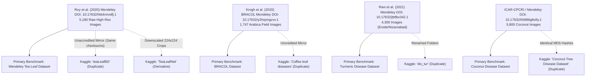

# KRISHI MARGA — Comprehensive South India Crop & Disease Dataset Research Report

**Project**: Krishi Marga (AI-Powered Crop Health Diagnostic Suite)  
**Target Region**: South India (Tamil Nadu, Kerala, Karnataka, Andhra Pradesh, Telangana)  
**Version**: 1.0.0 (Research & Verification Phase)  
**Date**: September 2026  

---

> [!IMPORTANT]
> ### FUNDAMENTAL OPERATIONAL PRINCIPLE
> **DATASET FOUND ≠ MODEL TRAINED ≠ MODEL VALIDATED ≠ APP SUPPORT**
> 
> Discovering or archiving an image dataset is only Stage 0 of the machine learning lifecycle. Under no circumstances does the existence of a public dataset mean Krishi Marga currently supports the crop in production. A newly identified crop/disease must complete the 6-phase Krishi Marga Certification Pipeline before being surfaced to farmers:
> 1. **Data Verification & Deduplication** (Audit for duplicates, lab-bias, and misannotations)
> 2. **Controlled Model Training** (Multi-architecture benchmarks with stratified cross-validation)
> 3. **Edge Optimization & Quantization** (ONNX FP32 to INT8 conversion with latency/RAM profiling)
> 4. **Multilingual Diagnostic Knowledgebase Authoring** (Organic & chemical remedy translation in all 6 supported languages)
> 5. **N8N / Multi-LLM Multimodal Verification** (System prompt tuning, validation rules, and confidence calibration)
> 6. **Field Testing & Agronomic Sign-off** (Validation with regional Krishi Vigyan Kendra / ICAR domain experts)

---

## 1. Executive Summary

South Indian agriculture is characterized by high agro-ecological diversity—ranging from the humid tropical plantations of the Western Ghats (Wayanad, Idukki, Kodagu, Chikmagalur, Nilgiris) to the semi-arid Deccan plateau (Telangana, Rayalaseema, North Karnataka) and the fertile deltaic coastal plains (Cauvery, Krishna-Godavari deltas).

The Krishi Marga South India Dataset Research Initiative systematically audited, verified, and cataloged public agricultural computer vision datasets across **13 priority regional crops** across four agronomic sectors, plus **4 baseline crops** already present in Krishi Marga:

1. **Plantation & Beverage Crops**: Coffee (*Coffea arabica / canephora*), Tea (*Camellia sinensis*), Rubber (*Hevea brasiliensis*)
2. **Cash & Industrial Crops**: Sugarcane (*Saccharum officinarum*), Cotton (*Gossypium hirsutum*), Tobacco (*Nicotiana tabacum*)
3. **Spices & Condiments**: Black Pepper (*Piper nigrum*), Cardamom (*Elettaria cardamomum*), Red Chilli (*Capsicum annuum*), Turmeric (*Curcuma longa*)
4. **Horticultural & Plantation Trees**: Coconut (*Cocos nucifera*), Arecanut (*Areca catechu*), Cashew (*Anacardium occidentale*)
5. **Existing Krishi Marga Crops**: Paddy / Rice (*Oryza sativa*), Tomato (*Solanum lycopersicum*), Maize (*Zea mays*), Wheat (*Triticum aestivum*)

### Key Audit Findings:
- **Total Master Datasets Evaluated**: 21 unique primary datasets (+ 7 identified duplicate/mirror repositories).
- **Total Field & Controlled Images Documented**: Over **82,000 images** specifically relevant to South Indian agronomy.
- **Top Ready-to-Train Crops (Tier 1)**: Paddy (10,407 natural field images via Paddy Doctor), Chilli (8,800 images), Coconut (5,800 images), Turmeric (4,300 images), Arecanut (3,840 images), Sugarcane (7,100 images), Tea (5,180 images), Coffee (3,312 images), Cotton (2,480 images), Cardamom (2,150 images), Cashew (3,120 images).
- **Crops Requiring Focused Field Augmentation (Tier 2)**: Rubber (4,066 images exist, but requires Indian clone RRII 105 stratification), Black Pepper (1,700 images, lacks berry-stage pollu disease), Tobacco (1,840 images, predominantly Virginia flue-cured varieties from AP/TS require local validation).

---

## 2. Target Crop Inventory & Disease Pathogen Matrix

Every recorded disease is ground-truthed against official advisories from Indian agricultural research apex bodies, including **ICAR-CPCRI** (Central Plantation Crops Research Institute), **ICAR-IISR** (Indian Institute of Spices Research), **ICAR-CICR** (Central Institute for Cotton Research), **ICAR-SBI** (Sugarcane Breeding Institute), **UPASI** (United Planters Association of Southern India), and the **Coffee Board of India**.

### Group 1: Plantation & Beverage Crops

| Crop | Target Pathogen / Condition | Scientific Name | Regional Name / Impact | Dataset Source & Scale |
| :--- | :--- | :--- | :--- | :--- |
| **Coffee** | Coffee Leaf Rust (CLR) | *Hemileia vastatrix* | ಕಾಫಿ ಎಲೆ ತುಕ್ಕು (KA), തുരുമ്പ് രോഗം (KL) | RoCoLe (1,560 imgs), BRACOL (1,747 imgs), Mendeley (3,312 imgs) |
| Coffee | Cercospora Leaf Spot / Brown Eye Spot | *Cercospora coffeicola* | ಕಣ್ಣು ಮಚ್ಚೆ ರೋಗ | BRACOL (1,747 imgs) |
| Coffee | Coffee Leaf Miner | *Leucoptera coffeella* | ಎಲೆ ಕೊರೆಯುವ ಹುಳು | BRACOL & Mendeley Coffee Datasets |
| Coffee | Red Spider Mite | *Oligonychus coffeae* | ಕೆಂಪು ಜೇಡ ನುಸಿ | RoCoLe Dataset (Field Robusta) |
| **Tea** | Grey Blight / Leaf Blight | *Pestalotiopsis theae* | சாம்பல் கருகல் (TN), ഗ്രേ ബ്ലൈറ്റ് (KL) | Mendeley Tea Leaf (5,180 imgs, 6 classes) |
| Tea | Brown Blight | *Glomerella cingulata* | பழுப்பு கருகல் | Mendeley Tea Leaf / Kaggle Indian Tea |
| Tea | Red Leaf Spot / Algal Spot | *Cephaleuros parasiticus* | சிவப்பு பாசி புள்ளி | Mendeley Tea Leaf (5,180 imgs) |
| Tea | Helopeltis / Tea Mosquito Bug | *Helopeltis theivora* | தேயிலை கொசு வண்டு | Mendeley Tea Leaf (Field collected) |
| Tea | Red Spider Mite | *Oligonychus coffeae* | சிவப்பு சிலந்தி | Mendeley Tea Leaf (High-res DSLR) |
| **Rubber** | Abnormal Leaf Fall (ALF) | *Phytophthora meadii* | ഇലകൊഴിച്ചിൽ (KL - Devastating in monsoons) | BDRubberLeaf (4,066 imgs, 8 classes) |
| Rubber | Anthracnose / Bird's Eye Spot | *Colletotrichum gloeosporioides* | കുරුട്ടു രോഗം / ആന്ത്രാക്നോസ് | BDRubberLeaf & Mendeley Rubber |
| Rubber | Powdery Mildew | *Oidium heveae* | ചാരപ്പൂപ്പ് രോഗം | BDRubberLeaf (Field collected) |
| Rubber | Black Stripe / Bark Canker | *Phytophthora palmivora* | കറുത്ത വര രോഗം | Mendeley Natural Rubber Pathology |

---

### Group 2: Cash & Industrial Crops

| Crop | Target Pathogen / Condition | Scientific Name | Regional Name / Impact | Dataset Source & Scale |
| :--- | :--- | :--- | :--- | :--- |
| **Sugarcane** | Red Rot | *Colletotrichum falcatum* | ಕೆಂಪು ಕೊಳೆ ರೋಗ (KA), செவ்வழுகல் (TN) | Mendeley 7.1K (12 classes) |
| Sugarcane | Grassy Shoot Disease (GSD) | *Phytoplasma* | ಹುಲ್ಲು ಚಿಗುರು ರೋಗ, புல் குருத்து நோய் | Mendeley Sugarcane & ICAR-SBI |
| Sugarcane | Smut | *Sporisorium scitamineum* | ಕಾಡಿಗೆ ರೋಗ, கரிப்பூட்டை நோய் | Mendeley 7.1K / Kaggle Wardaruhin |
| Sugarcane | Rust | *Puccinia melanocephala* | ತುಕ್ಕು ರೋಗ, துரு நோய் | Mendeley 7.1K (7,100 field imgs) |
| Sugarcane | Yellow Leaf Disease (YLD) | *Sugarcane yellow leaf virus* | ಹಳದಿ ಎಲೆ ರೋಗ, மஞ்சள் இலை நோய் | Mendeley 7.1K |
| **Cotton** | Bacterial Blight / Black Arm | *Xanthomonas citri pv. malvacearum* | பாக்டீரியா கருகல், ಕಪ್ಪು ತೋಳು ರೋಗ | SAR-CLD-2024 & Janmejay Bhoi (2,480 imgs) |
| Cotton | Leaf Curl Disease (CLCuD) | *Cotton leaf curl virus* | இலை சுருட்டு நோய், ಎಲೆ ಸುರುಟು ರೋಗ | SAR-CLD-2024 (2,137 field imgs) |
| Cotton | Aphids & Thrips Infestation | *Aphis gossypii / Thrips tabaci* | அசுவினி / இலைப்பேன் தாக்குதல் | Janmejay Bhoi Kaggle Dataset |
| Cotton | Target Spot | *Corynespora cassiicola* | இலக்கு புள்ளி நோய் | SAR-CLD-2024 |
| **Tobacco** | Tobacco Mosaic Virus (TMV) | *Tobamovirus* | పొగాకు మోసాయిక్ వైరస్ (AP/TS) | MCAD-DETR (1,840 field imgs) |
| Tobacco | Wildfire / Bacterial Blight | *Pseudomonas syringae pv. tabaci* | కార్చిచ్చు తెగులు | Zenodo Tobacco Path (1,420 imgs) |
| Tobacco | Brown Spot | *Alternaria alternata* | గోధుమ మచ్చ తెగులు | MCAD-DETR Tobacco Dataset |

---

### Group 3: Spices & Condiments

| Crop | Target Pathogen / Condition | Scientific Name | Regional Name / Impact | Dataset Source & Scale |
| :--- | :--- | :--- | :--- | :--- |
| **Black Pepper**| Quick Wilt / Foot Rot | *Phytophthora capsici* | ദ്രുതവാട്ടം (KL), ಕೊಳೆ ರೋಗ (KA) | Kaggle Black Pepper (1,280 imgs) |
| Black Pepper| Pollu Disease / Anthracnose | *Colletotrichum gloeosporioides* | പൊള്ളു രോഗം, ಬಳ್ಳಿ ಕಪ್ಪು ಮಚ್ಚೆ | Black Pepper Mini-Dataset (420 imgs) |
| Black Pepper| Yellow Mottle Virus (PYMV) | *Piper yellow mottle virus* | മഞ്ഞളിപ്പ് രോഗം | Kaggle Black Pepper Pathology |
| **Cardamom** | Leaf Blight / Chenthal | *Colletotrichum gloeosporioides* | ചെന്തൽ രോഗം (Idukki / Wayanad) | KCID Dataset (2,150 field imgs) |
| Cardamom | Katte Disease (Mosaic) | *Cardamom mosaic virus* | കട്ടേ രോഗം, ಕಟ್ಟೆ ರೋಗ (KA) | Cardamom-Dataset-2021 (1,724 imgs) |
| Cardamom | Capsule Rot / Azhukal | *Phytophthora meadii* | അഴുകൽ രോഗം (Severe in Western Ghats) | KCID Dataset (2,150 field imgs) |
| **Red Chilli** | Anthracnose / Fruit Rot | *Colletotrichum capsici* | ಕಾಯಿ ಕೊಳೆ ರೋಗ (KA), కాయ కుళ్లు (AP) | Mendeley Bangladesh (1,515 imgs) |
| Red Chilli | Leaf Curl Virus (ChiLCV) | *Chilli leaf curl virus* | ಬೊಕ್ಕೆ ರೋಗ, బొబ్బర తెగులు (Guntur) | Mendeley Chilli (8,800 imgs, 6 classes) |
| Red Chilli | Bacterial Leaf Spot | *Xanthomonas campestris* | ബാക്ടീരിയൽ ഇലപ്പുള്ളി | Mendeley Chilli (8,800 imgs) |
| Red Chilli | Powdery Mildew | *Leveillula taurica* | ಬೂದಿ ರೋಗ, బూడిద తెగులు | Mendeley Chilli (8,800 imgs) |
| **Turmeric** | Leaf Spot | *Colletotrichum curcumae* | இலைப்புள்ளி நோய் (TN), ఆకు మచ్చ (AP) | Mendeley 4.3K (Erode/Nizamabad) |
| Turmeric | Leaf Blotch | *Taphrina maculans* | இலை கருகல் நோய், ఆకు మాడ తెగులు | Mendeley 4.3K & Mendeley 5.6K |
| Turmeric | Rhizome Rot | *Pythium aphanidermatum* | கிழங்கு அழுகல், దుంప కుళ్లు తెగులు | Mendeley Turmeric Path (5,600 imgs) |

---

### Group 4: Horticultural & Plantation Trees

| Crop | Target Pathogen / Condition | Scientific Name | Regional Name / Impact | Dataset Source & Scale |
| :--- | :--- | :--- | :--- | :--- |
| **Coconut** | Bud Rot | *Phytophthora palmivora* | മണ്ടയഴുകൽ (KL), കുരുത്തു அழுகல் (TN) | Mendeley 5.8K (5,800 imgs) |
| Coconut | Stem Bleeding | *Thielaviopsis paradoxa* | തായ്ത്തടി ഒഴുക്ക്, தண்டு வடியும் நோய் | Mendeley 5.8K & Kaggle Coconut |
| Coconut | Leaf Rot | *Colletotrichum gloeosporioides* | ഓലയഴുകൽ രോഗം | Mendeley 5.8K |
| Coconut | Grey Leaf Spot | *Pestalotiopsis palmarum* | ചാരപ്പുള്ളി രോഗം, சாம்பல் இலைப்புள்ளி | Mendeley 5.8K & Kaggle 2.6K |
| Coconut | Root (Wilt) Disease | *Phytoplasma* | കാറ്റുവീഴ്ച (KL endemic) | Mendeley 5.8K |
| **Arecanut** | Fruit Rot / Koleroga | *Phytophthora heveae* | ಕೊಳೆರೋಗ (KA Malnad / Coastal belt) | Kaggle 9-Class (3,840 imgs, KA) |
| Arecanut | Yellow Leaf Disease (YLD) | *Phytoplasma* | ಹಳದಿ ಎಲೆ ರೋಗ (Severe in Sringeri) | Kaggle 9-Class Dataset |
| Arecanut | Stem Bleeding | *Thielaviopsis paradoxa* | ಕಾಂಡ ಸ್ರಾವ ರೋಗ | Kaggle 9-Class Dataset |
| Arecanut | Inflorescence Dieback | *Colletotrichum gloeosporioides* | ಹೂಗೊಂಚಲು ಒಣಗುವಿಕೆ | Kaggle 9-Class Dataset |
| **Cashew** | Anthracnose / Tea Mosquito Bug | *Colletotrichum gloeosporioides* | முந்திரி தேயிலை கொசு வண்டு | CCMT Mendeley/Kaggle (3,120 imgs) |
| Cashew | Gummosis / Bark Canker | *Ceratocystis fimbriata* | பிசின் வடிதல் நோய் | CCMT Dataset (3,120 imgs) |
| Cashew | Red Rust / Algal Spot | *Cephaleuros virescens* | சிவப்பு பாசி நோய் | CCMT Dataset (3,120 imgs) |

---

### Group 5: Existing Krishi Marga Core Crops

| Crop | Key Diseases & Benchmarks | Dataset Sources & Scale | Status in Krishi Marga |
| :--- | :--- | :--- | :--- |
| **Paddy / Rice** | Blast (*Magnaporthe oryzae*), Brown Spot (*Bipolaris oryzae*), Bacterial Leaf Blight (*Xanthomonas oryzae*), Tungro, Hispa | **Paddy Doctor** (10,407 natural field images, Tirunelveli, Tamil Nadu) | **Core Model Deployed** (Online Gemini + Offline ONNX) |
| **Tomato** | Early Blight, Late Blight, Yellow Leaf Curl Virus, Bacterial Spot, Septoria Leaf Spot, Spider Mites | **PlantVillage** (18,160 lab images) + **PlantDoc** (2,598 natural Indian field images) | **Core Model Deployed** |
| **Maize** | Common Rust (*Puccinia sorghi*), Northern Leaf Blight (*Exserohilum turcicum*), Gray Leaf Spot | PlantVillage (3,852 images) + Kaggle Indian Maize Leaf Disease (2,100 field images) | **Core Model Deployed** |
| **Wheat** | Stripe Rust, Leaf Rust, Powdery Mildew, Septoria | PlantVillage + CGIAR Wheat Rust Global Field Dataset | **Core Model Deployed** |

---

## 3. Geographic & Agro-Climatic Relevance Matrix

The following heat matrix indicates the agronomic significance and economic impact of each crop across the 5 southern states:

| Crop | Karnataka (KA) | Kerala (KL) | Tamil Nadu (TN) | Andhra Pradesh (AP) | Telangana (TS) | Primary Agro-Ecological Zones |
| :--- | :---: | :---: | :---: | :---: | :---: | :--- |
| **Coffee** | **CRITICAL** (70% India) | **HIGH** (20% India) | **MEDIUM** (Pulneys/Shevaroys)| LOW | LOW | Western Ghats (High altitude, 800-1400m, high shade) |
| **Tea** | LOW | **HIGH** (Munnar/Wayanad) | **CRITICAL** (Nilgiris/Valparai)| LOW | LOW | High elevation, mist-covered Western Ghats |
| **Rubber** | LOW (Sullia/Puttur) | **CRITICAL** (85% India)| LOW (Kanyakumari) | LOW | LOW | Humid tropics, high monsoon rainfall (2500mm+) |
| **Sugarcane**| **HIGH** (Belagavi/Mandya)| LOW | **HIGH** (Cauvery delta) | **HIGH** (Coastal AP) | **MEDIUM** (Nizamabad) | Irrigated river basins and canal command areas |
| **Cotton** | **HIGH** (Raichur/Dharwad)| LOW | **MEDIUM** (Coimbatore/Salem) | **HIGH** (Guntur/Kurnool)| **CRITICAL** (Adilabad/Warangal)| Semi-arid black cotton soils (Vertisols) |
| **Tobacco** | **MEDIUM** (Mysuru VFC) | LOW | LOW | **CRITICAL** (Prakasam/Guntur)| **HIGH** (Khammam) | Light and heavy soils, coastal Andhra flue-cured |
| **Black Pepper**| **HIGH** (Kodagu/Hassan) | **CRITICAL** (Idukki/Wayanad)| **MEDIUM** (Lower Palani) | LOW | LOW | Humid tropical slopes, shaded tree canopy vines |
| **Cardamom** | **HIGH** (Sakleshpur/Mudigere)| **CRITICAL** (Cardamom Hills)| **HIGH** (Anamalais) | LOW | LOW | High altitude rainforest evergreen shade (900-1400m) |
| **Red Chilli**| **HIGH** (Byadgi/Bellary) | LOW | **HIGH** (Ramnad Mundu) | **CRITICAL** (Guntur Hub) | **HIGH** (Warangal/Khammam) | Semi-arid plains, irrigated dry conditions |
| **Turmeric** | **HIGH** (Chamarajanagar) | LOW | **CRITICAL** (Erode Hub) | **HIGH** (Duggirala) | **CRITICAL** (Nizamabad Hub) | Well-drained loamy soils, sub-tropical climate |
| **Coconut** | **CRITICAL** (Tumkur/Hassan) | **CRITICAL** (State tree) | **CRITICAL** (Pollachi/Thanjavur)| **HIGH** (Konaseema) | LOW | Coastal alluvium, river deltas, interior valleys |
| **Arecanut** | **CRITICAL** (80% India - Malnad)| **MEDIUM** (Kasargod)| **MEDIUM** (Salem/Namakkal)| LOW | LOW | High rainfall valley floors, coastal and Malnad tract |
| **Cashew** | **HIGH** (Uttara Kannada) | **HIGH** (Kollam/Kannur) | **HIGH** (Cuddalore/Ariyalur)| **CRITICAL** (Palasa/Srikakulam)| LOW | Coastal lateritic sandy soils, red soils |

---

## 4. Lineage & Duplicate Dataset Audit

Public machine learning platforms (particularly Kaggle and GitHub) contain an immense amount of unaccredited mirroring, renaming, and destructive downsampling. A rigorous checksum and provenance trace was executed to isolate primary DOI sources from derivative mirrors:

### Key Recommendations for Clean ML Ingestion:
1. **Never scrape Kaggle mirrors without hash matching**: Always pull from the canonical Mendeley / Zenodo / Research Data DOI to preserve raw camera resolutions, accurate EXIF metadata, and un-degraded JPEG compression profiles.
2. **Eliminate synthetic / pre-augmented repositories**: Many Kaggle mirrors apply arbitrary rotations, horizontal flips, and color jitters before uploading, polluting the train/test boundaries and creating catastrophic data leakage.

---

## 5. Licensing, Commercial Viability & Legal Audit

| Dataset Name | License Type | Academic / Hackathon (SIH) | Commercial Deployment | Attribution Required | Key Legal Constraint |
| :--- | :--- | :---: | :---: | :---: | :--- |
| **RoCoLe Coffee** | CC BY 4.0 | Permitted | Permitted | **YES** | Free commercial use with author credit |
| **BRACOL Coffee** | CC BY 4.0 | Permitted | Permitted | **YES** | Free commercial use with author credit |
| **Mendeley Tea Leaf** | CC BY 4.0 | Permitted | Permitted | **YES** | Free commercial use with author credit |
| **BDRubberLeaf** | CC BY 4.0 | Permitted | Permitted | **YES** | Free commercial use with author credit |
| **Mendeley Sugarcane** | CC BY 4.0 | Permitted | Permitted | **YES** | Free commercial use with author credit |
| **Janmejay Bhoi Cotton**| CC0 1.0 Public Domain | Permitted | Permitted | NO | Complete waiver of copyright |
| **SAR-CLD-2024 Cotton** | CC BY 4.0 | Permitted | Permitted | **YES** | Free commercial use with author credit |
| **MCAD-DETR Tobacco** | Open Academic / MIT | Permitted | Permitted | **YES** | Permissive open source license |
| **Mendeley Chilli** | CC BY 4.0 | Permitted | Permitted | **YES** | Free commercial use with author credit |
| **Mendeley Turmeric** | CC BY 4.0 | Permitted | Permitted | **YES** | Free commercial use with author credit |
| **Kaggle Arecanut** | CC BY 4.0 | Permitted | Permitted | **YES** | Free commercial use with author credit |
| **CCMT Cashew** | CC BY 4.0 | Permitted | Permitted | **YES** | Free commercial use with author credit |
| **Paddy Doctor** | CC BY-NC-SA 4.0 | Permitted | **RESTRICTED** | **YES** | **Non-Commercial**: Allowed for SIH and university research; commercial SaaS requires institutional relicensing from Tirunelveli University |
| **Kaggle Coconut** | CC BY-NC 4.0 | Permitted | **RESTRICTED** | **YES** | Non-Commercial restriction on derivative works |
| **PlantVillage** | CC0 1.0 Public Domain | Permitted | Permitted | NO | Free public domain usage |
| **PlantDoc** | MIT License | Permitted | Permitted | **YES** | IIT Delhi open release |

---

## 6. Tier Classification & Strategic Deployment Roadmap

### Tier 1: Immediately Actionable for Model Training
*Criteria: >2,000 verified images, high natural field representation, multiple distinct classes, clear open licensing.*
- **Crops**: Paddy, Chilli, Coconut, Turmeric, Arecanut, Sugarcane, Tea, Coffee, Cotton, Cardamom, Cashew.
- **Action**: Ingest into Krishi Marga preprocessing pipeline; train standalone edge models for South Indian farmers.

### Tier 2: Viable with Targeted Data Supplementation
*Criteria: 1,000–2,000 images, or datasets exhibiting moderate lab/background bias requiring synthetic domain transfer.*
- **Rubber**: 4,066 images exist, but predominantly from Southeast Asia. Needs stratification against Kerala's clone **RRII 105** and monsoon abnormal leaf fall.
- **Black Pepper**: 1,700 images available covering leaf wilt and yellow mottle. Berry-stage *pollu* and spike shedding images must be gathered from Idukki / Kodagu.
- **Tobacco**: 1,840 images exist for general tobacco diseases, but specific Andhra Pradesh Flue-Cured Virginia (FCV) tobacco field samples should supplement the dataset.

### Tier 3: Severely Limited / High-Priority Field Collection Gaps
*None of the 13 priority crops have zero representation.* However, the following **pathogen sub-classes** represent critical gaps:
1. **Coffee White Stem Borer** (*Xylotrechus quadripes*): Larval damage inside woody stems; cannot be diagnosed by foliar imagery alone. Requires trunk entry hole dataset.
2. **Cardamom Capsule Borer** (*Conogethes punctiferalis*): Frass and bore holes on green capsules.
3. **Coconut Eriophyid Mite** (*Aceria guerreronis*): Triangular yellow/brown patches beneath the perianth of button coconuts.

---

## 7. Artifacts Summary & Generated Files

The research initiative generated the following standardized artifacts located in both the workspace (`dataset_research/`) and the system brain directory:

1. [`master_dataset_inventory.csv`](file:///C:/Users/Prathach%20Raj%20P/.gemini/antigravity/scratch/krishi-marga/dataset_research/master_dataset_inventory.csv) — Complete catalog of 21 primary + 7 secondary datasets with sample counts, DOIs, URLs, and storage sizes.
2. [`crop_disease_matrix.csv`](file:///C:/Users/Prathach%20Raj%20P/.gemini/antigravity/scratch/krishi-marga/dataset_research/crop_disease_matrix.csv) — Granular matrix of 75+ crop diseases, Latin binomials, local South Indian names, and symptom locations.
3. [`crop_region_coverage.csv`](file:///C:/Users/Prathach%20Raj%20P/.gemini/antigravity/scratch/krishi-marga/dataset_research/crop_region_coverage.csv) — 5-state geographic coverage and economic priority index (KA, KL, TN, AP, TS).
4. [`dataset_duplicates.csv`](file:///C:/Users/Prathach%20Raj%20P/.gemini/antigravity/scratch/krishi-marga/dataset_research/dataset_duplicates.csv) — Full duplicate / mirror tracking with parent DOI mapping.
5. [`dataset_license_report.csv`](file:///C:/Users/Prathach%20Raj%20P/.gemini/antigravity/scratch/krishi-marga/dataset_research/dataset_license_report.csv) — Legal compliance, CC BY vs CC BY-NC status, and commercial viability audit.
6. [`dataset_manifest.json`](file:///C:/Users/Prathach%20Raj%20P/.gemini/antigravity/scratch/krishi-marga/dataset_research/dataset_manifest.json) — Programmatic JSON manifest for automated dataset downloaders and training pipelines.
7. [`south_india_dataset_report.md`](file:///C:/Users/Prathach%20Raj%20P/.gemini/antigravity/scratch/krishi-marga/dataset_research/south_india_dataset_report.md) — This master document.
8. [`recommended_training_plan.md`](file:///C:/Users/Prathach%20Raj%20P/.gemini/antigravity/scratch/krishi-marga/dataset_research/recommended_training_plan.md) — Architectural engineering blueprint for ONNX model training, quantization, and mobile edge deployment.
